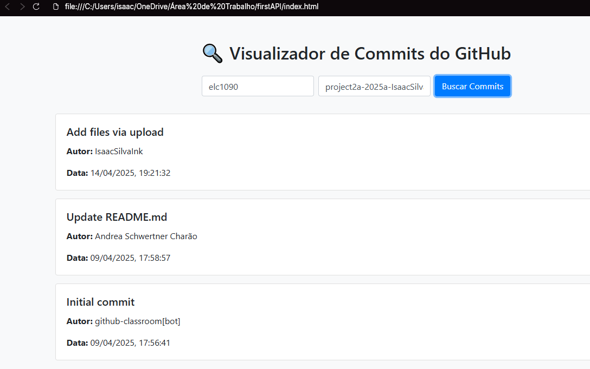

# Projeto2a: GitHub API e DOM Manipulation

.

#### Deploy

[Link para o site](https://elc1090.github.io/project2a-2025a-IsaacSilvaInk/)

#### Desenvolvedor

Isaac Silva Dos Santos

#### Ambiente de desenvolvimento
- VS Code
- Bloco de notas(CSS)
- Pycharm

#### Créditos

Entender este código base e tutorial foi a chave para conseguir fazer o site: https://github.com/timmywheels/github-api-tutorial
Os demais processos, como adicionar a opção de digitar o nome do repositório seguem a mesma base de buscar o nome do código original.

#### Bastidores

A parte mais desafiadora deste exercício foi entender o que acontecia no "app.js", eu nunca tinha visto o comando "const" antes, mas com o auxílio do ChatGPT consegui entender sua função no código. Entendi que a função fetch é muito importante para que o Json se "interligue" com  API de certa forma. E então depois de entender o código e modificá-lo para sua nova função usei bootstrap para dar uma leve mudada no design da página.

---
Projeto entregue para a disciplina de [Desenvolvimento de Software para a Web](http://github.com/andreainfufsm/elc1090-2025a) em 2025a
